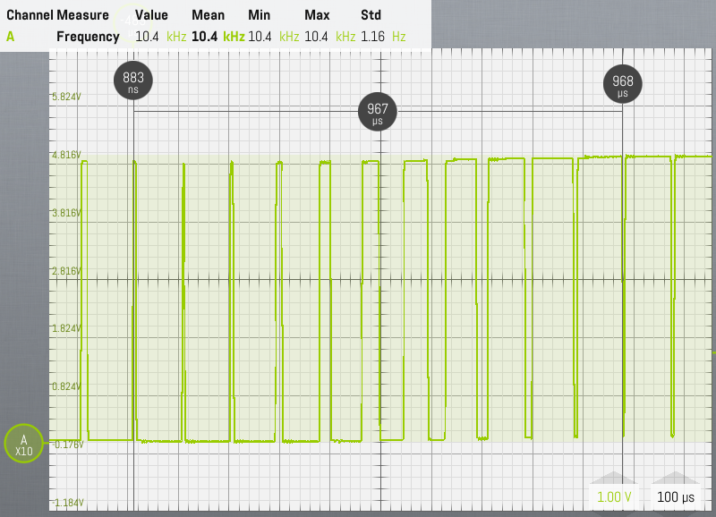
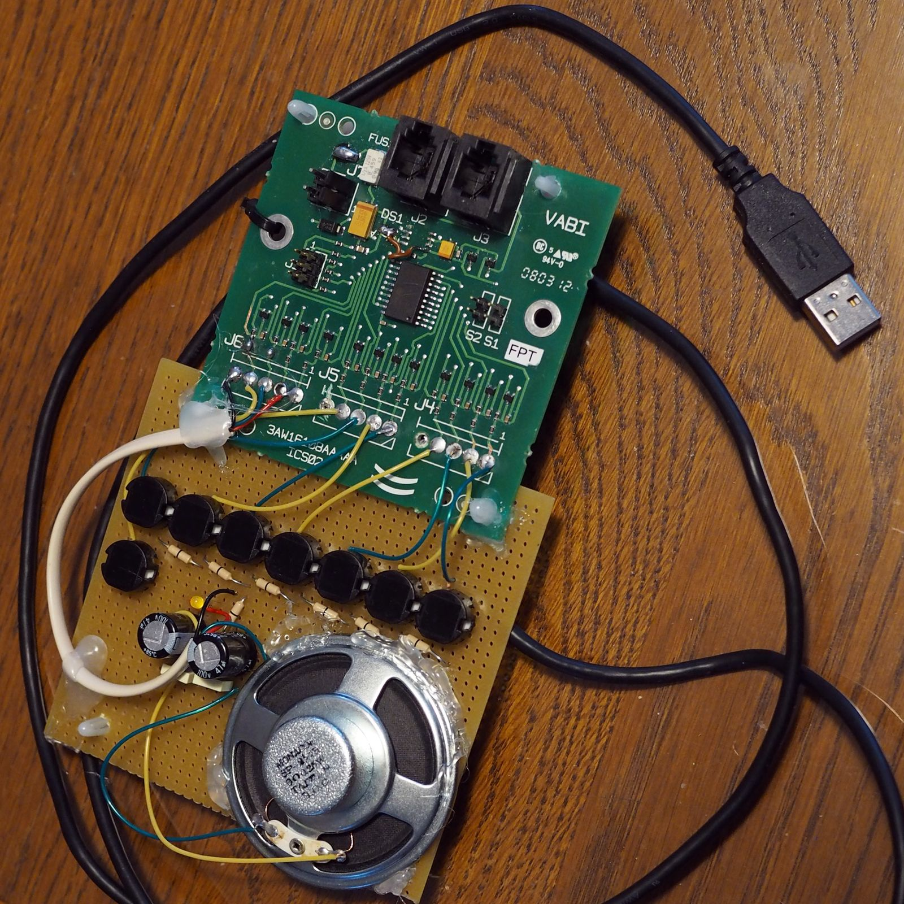

# Diatonic Score Tone Generator With a Tiny Microcontroller

This repository stores notes and sources for a recreational project: make a small monophonic diatonic score generator on two scales using a very small microcontroller (ATtiny 2313).

To achieve this, two digital outputs in opposite state are connected to a small speaker and sine wave corresponding to a given note is divided in **twenty PWM** samples where each **duty cycle** is the image of this sine wave. A duty cycle of 95% represents 1 of this sine wave, a duty cycle of 50% represent 0, and one of 5% represents -1.

Eight inputs make a basic keyboard: seven are dedicated to the seven notes **C, D, E, F, G, A, B**, and the eight one is a shift to the next octave.

Frequencies for those notes are based on **A4** at **440 Hz**. *Well tempered* tuning is considered: each half tone is calculated by multiplying frequency by **12th root of two**. So C is 523 Hz (above A4), D is 587 Hz, etc.

So, **two octaves** are covered: from **C5** to **B5**, also known as *two-lined* octave and from C6 to B6, also known as *three-lined* octave. Frequencies covered span from **523 Hz** to **1,976 Hz**.

This train of PWM samples is directly connected to the speaker with capacitor filters connected to the zero volt reference.

An LED will also flash at a frequency which mimics the note frequency: from one Hertz at C5 to 14 Hz at B6. 

This gadget is powered by **USB** A-type plug at 5 Volts.

# Comments on Documents

## Schematics

This project is based on an existing PCB centered on the micro-controller with twelve inputs. Each input is protected by a series resistor, pulled-up with another resistor and filtered by a capacitor. This PCB has been modified to be directly powered by a simple A USB connector which supplies 5 Volts. Also four inputs have been turned into outputs. Two outputs have their series resistors shorted to supply more current to the speaker.

On schematics, the existing PCB, as it has been modified, is surrounded by a dotted-line rectangle and supplementary components, keys, LED, filter are soldered on a separate perfboard.

Choice of a ATtiny2313 is made because of an existing design has been used. This design is based on a SMT PCB which was available and is no longer used. Port to another processor (for example an Atmega328 with a DIL package) and simplified input circuitry can be easily used.

## Calculation Spread Workbook

This workbook is composed of three spreadsheets.

First spread sheet calculates PWM samples in order to build a lookup table in C. First, frequencies are calculated by multiplying half-tones by 12th root of 2 in a geometric progression:

1. C5: 523 Hz, C6: 1,047 Hz
2. D5: 587 Hz, D6: 1,175 Hz
3. E5: 659 Hz, E6: 1,319 Hz
4. F5: 698 Hz, F6: 1,379 Hz
5. G5: 784 Hz, G6: 1,568 Hz
6. A5: 880 Hz, A6: 1,760 Hz
7. B5: 988 Hz, B6: 1,976 Hz

Each frequency period (example 1,911 µs for 523 Hz) is divided by 20 (PWM samples) which gives 95.5 µs in our example. As the 16-bit timer1 used in the microcontroller has a 125 ns period, it makes 95.5 x 8 = 764 counts for this period.

PWM width for each sample is the image of a sine curve. For example at 18°, sine is 0.31, as amplitude is 45% of duty cycle, 0.31 x 0.45 is 13.9 %. As zero is 50%, value for 18° is 50% + 13.9% = 63.9 %. In the paragraph above, period was 764 counts: this makes the PWM value for 18° to be 764 x 63.9% = 489 counts.

Note: values given above are rounded. In the spreadsheets, intermediate values are not rounded like this.

Second spreadsheet helps calculating capacitance of a first-order low-pass RC filter. During tests this proved to be useless, so try and error method was used instead.

Third spreadsheet computes the lookup table for the LED. We wanted the LED to flash between 1/4 Hz when no key was pressed to around 14 Hz for the highest pitch (B6). Those frequencies are listed on the left column in the main spreadsheet table. Those LED frequencies also follow a geometric progression. This table calculates the number of 2,048-ms cycles of timer0 to cover a half period of each LED flashing frequency.

## Source Code and Microcontroller Setting

Source code is documented, so its reading should not be too tough.

Lookup tables are stored as 16-bit (word) values in flash, so they are accessed through a `pgm_read_word` call.

Watchdog is also managed, so watchdog timer fuse `WDTON`  can enable this function.

Microcontroller is supposed to run at 8 MHz using its internal calibrated RC oscillator with no pre-scaling (`CKDIV8` fuse unprogrammed).

Internal oscillator calibrated value is expected at last EEPROM location.

Timer0 manages key debouncing and LED flashing. It is programmed as free running topping at 255 and a prescaler at 64, so its cycle time (each time it crossed its `TOP` value) is 125 ns x 64 x 256 = 2,048 ms

Timer1 manages PWM generation on pins `OC1A` and `OC1B`, in opposed phase: when one is at 1 the other is at 0. It runs in fast PWM mode with prescaling set at 1: so each count is 125 ns. `TOP` value is stored in `ICR1` and PMW duty cycle in `OC1A` and `OC1B`.

When no sound is expected `PB4` and `PB4` (`OC1A` and `OC1B`) are set as inputs.

Both timers have timer overflow interrupts enabled: when they reach their `TOP` values, an interrupt is raised. Processing in the interrupt is kept very simple: only raise a flag and for timer 1 reload `TOP` and duty cycle values.

Main loop manages effects of interrupts. When a key stroke is sensed, variables `note` and `secondOctave` are refreshed. `note` is an index between 0 and 6 in the lookup table and `secondOctave` a `boolean` type.

When `secondOctave` is `TRUE`, lookup table is read twice as fast (only ten samples instead as twenty, so ten are simply skipped). It was not the case initially as lookup table also covered C6 to B6. However due to processor limitations it appeared we could not generate frequencies above 1,400 Hz.

Setting of processor is such:

- Oscillator calibration byte at 8MHz stored in EEPROM at address `0x7f`,
- Fuses: `EESAVE` programmed, `SPIEN` programmed, `WDTON` programmed, `BODLEVEL1` and `BODLEVEL0` programmed, `SUT0` programmed, `CKSEL3`,  `CKSEL1` and `CKSEL0` programmed , *all other fuses unprogrammed*. Reminder: a *programmed* fuse is set at a *zero* level.

IDE used for composing, compiling, building , and programming: Atmel Studio 7 (gcc version 5.4.0). Flash occupancy for this program: 51 %.

# Illustrative Material

Unloaded output driving speaker:

We can see the PWM going from -1 (very narrow duty cycle) to +1 (very wide duty cycle) for note C5 at 523 Hz. We have 967 µs for a half period, which give 517 Hz.

How a prototype assembly looks like:

Demo video: [demo.avi](./demo.avi)
